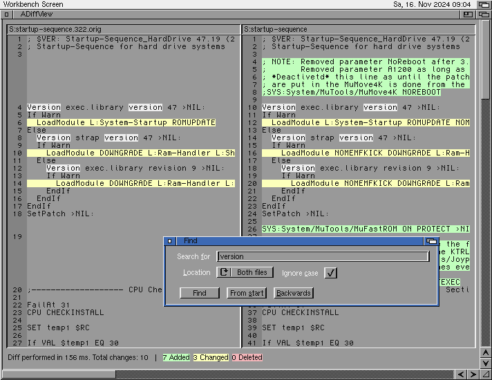

# README

## About

ADiffView is a diff tool for Amiga computers. It compares two ASCII text
files and displays the differences side by side.

It needs at least AmigaOS3.0 to run but utilizes one feature
*("Offscreen dragging" for its windows when own screen is used)* of
recent OS3.1.4.



The diff engine uses Eugene Myers' diff algorithm and also third-party 
code in its implementation. See the LICENSE-3RD-PARTY file for more 
information.

## Development environment

ADiffView can be build under Linux with *cmake* and [Bebbos gcc 6.5
toolchain](https://github.com/bebbo/amiga-gcc) or on an Amiga with
*StormC4*.

## Build with Linux
### Dependencies

The project was built with Debian on Windows with the Linux subsystem
(WSL). The following packages must bbe installed in Debian:

 - build-essentials
 - cmake
 - git
 - ([Bebbos gcc 6.5 toolchain @ Github, retired](https://github.com/bebbo/amiga-gcc))
 - ([Bebbos gcc 6.5 toolchain @ Codeberg](https://codeberg.org/bebbo/amiga-gcc))
which is expected to be installed in /opt

**Note:** for the Codeberg variant, you'll have to replace

```bash
git clone https://github.com/bebbo/amiga-gcc
```

with

```bash
git clone https://franke.ms/git/bebbo/amiga-gcc.git
```

As demonstrated in an [Amiga forum](https://www.a1k.org/forum/index.php?threads/94725/post-1882035).

### Build
The Makefile to build this project must be created with cmake.

In the root directory of the project, enter:

```bash
mkdir build
cd build
cmake ..
```

Once cmake has finished without errors, the project can be build:
    
```bash
make -j4
```

### VSCode integration

On a Linux machine open the ADiffView directory in VSCode.

The VSCode default build task (see tasks.json) was set up to use the
manually created Makefile above.

From within VSCode building can be started with **Ctrl + Shift + b**.

Then the Amiga 68k binary ADiffView_gcc is rebuild according to the
changes made to the source code. This ia a stripped release build for
68k Amigas.

### Build and run the unit tests
There are some unit tests in directory `src/diffengine/test_boost/`.

To build them the *boost framework* and *qt/qmake* must be installed on
the developer machine. In Debian:

```bash
sudo apt install qt5-qmake qtbase5-dev libboost-all-dev
```

To prepare and build the unit tests, change to the project root
directory and enter:

```bash
mkdir build-tests
cd build-tests
qmake ../src/diffengine/test_boost/DiffEngine_test_boost.pro
make -j4
```

Now the tests are build initially. To rebuild and run the tests after
code changes, press *F5* in VSCode

## Build on Amiga

**NOTE:** *Starting with latest version, ADiffView uses features of the
2022 released [NDK3.2](https://aminet.net/package/dev/misc/NDK3.2) - and
this is not working with StormC4. The developers are still working on
the NDK and - but until it is fixed this chapter isn't true anymore and
building is only available from Linux with bebbos gcc.*

A project file for StormC4 is included so that the project can also be
built on the Amiga.

StormC4 contains a working source-level debugger with variable display.
This was an important tool during development.

### Dependencies

- [StormC4](https://www.amiga-shop.net/en/Amiga-Software/Amiga-Tools/StormC-v4::145.html)
- [STL implementation for StormC4](http://aminet.net/package/dev/c/amigastlport)

### Build and run

To build with StormC4 click on the button *Open project* and select the
file `ADiffView.¶`

Press *F8* to start building.

To run ADiffView after a successful build click on the *Run* icon or
press *F9*.
